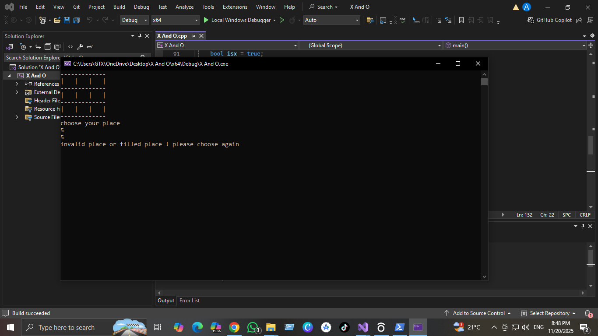
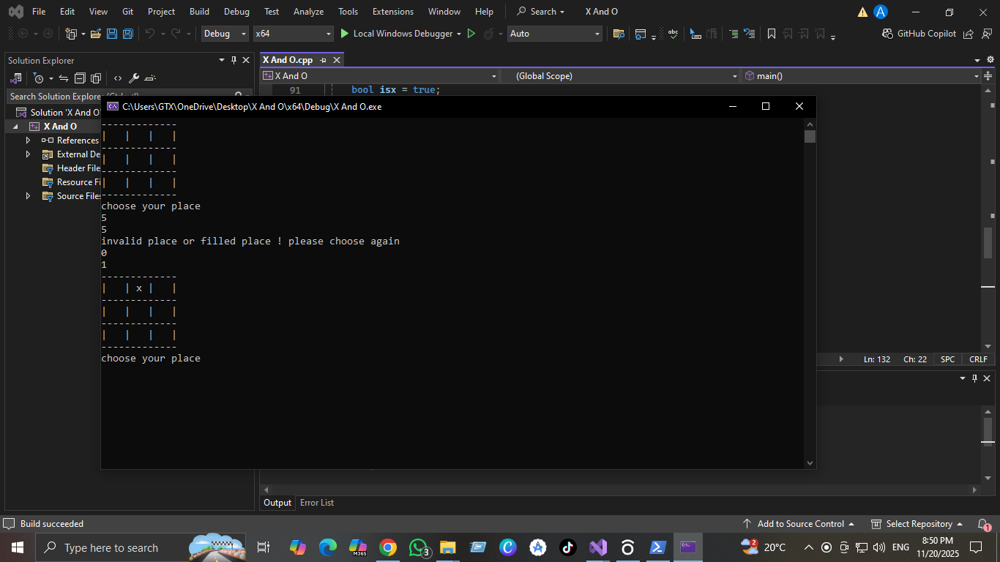
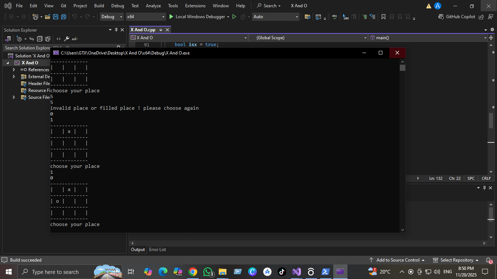
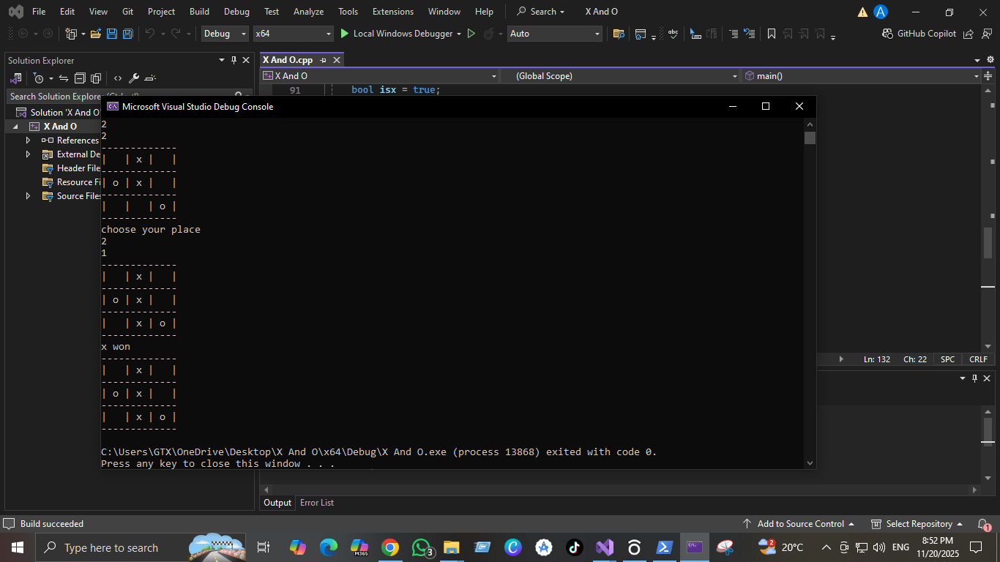

# XO Game (C++)

This is a simple **Tic-Tac-Toe (XO) Game** implemented in **C++** using console input/output.  

## Features

- Play XO game in console
- 2-player mode
- Shows current player turn
- Detects winner or draw
- Demonstrates use of:
  - Functions
  - Loops (for, while)
  - 2D arrays
  - Arrays and dynamic memory

## Screenshots

## How to Run

1. Open the project in **Visual Studio**.
2. Build and run the solution.
3. Follow console instructions to play the game.

## Notes

- Good practice for beginners to understand loops, functions, and arrays.
- Can be extended with AI or GUI in future updates.
